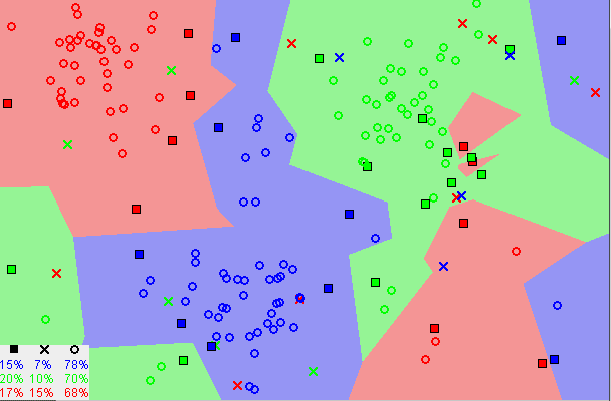
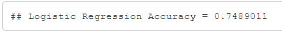
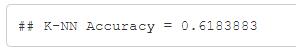

# Detection of Hepatocellular Carcinoma (HCC) Survival
# Background and motivation
Hepatocellular carcinoma (HCC) is the most common type of primary liver cancer. HCC mostly happen to people who has chronic liver diseases, like cirrhosis caused by hepatitis B or hepatitis C. It’s also common with people who drink a lot of alcohol and who have fat in the liver.

* **Diagnosis**: Blood test, Liver biopsy, Imaging test.

* **Treatment**: Surgery, Liver transplant surgery, Radiation therapy, Chemotherapy, Targeted drug therapy, Immunotherapy.

## Our motivation
HCC is the sixth most common cancer worldwide and the third most common cause of cancer death. In Egypt, liver cancer forms 1.68% of the total malignancies. HCC constitutes 70.48% of all liver tumors among Egyptians. HCC represents the main complication of cirrhosis. Thus, we were curious about this topic.
 

# Data set
Hepatocellular Carcinoma Dataset (HCC dataset) was collected at a University Hospital in Portugal. It contains several demographic, risk factors, laboratory and overall survival features of 165 real patients diagnosed with HCC. The date of donation of this data is: 29 November, 2017 and here is some information about this dataset:
* **Data Set Characteristics (Data Type):** Multivariate.
* **Associated Task:** Classification and Clustering.
* **Number of instances (records):** 165.
* **Number of features (attributes):** 49.
* **Selected according to:** The EASL-EORTC (European Association for the Study of the Liver - European Organization for Research and Treatment of Cancer) Clinical Practice Guidelines, which are the current state-of-the-art on the management of HCC. 
* **Attributes Characteristics:** Categorical, Integer and
Real.
* **Missing Data:** Yes. 
* This is a heterogeneous dataset, with 23 quantitative
variables, and 26 qualitative variables. The missing data represents 10.22% of the whole dataset and only eight patients have complete information in all fields (4.85%). The target variables are the survival at 1 year, and was encoded as a binary variable: 0 (dies) and 1 (lives). A certain degree of class-imbalance is
also present (63 cases labeled as “dies” and 102 as “lives”).
* These are our  attributes: 
Gender, Symptoms, Alcohol, HBsAg, HBeAg, HBcAb, HCVAb, Cirrhosis, Endemic countries, Smoking,
Diabetes, Obesity, Hemochromatosis, AHT, CRI, HIV,
NASH, Esophageal varices, Splenomegaly, Portal hypertension, Portal vein thrombosis, Liver metastasis, Radiological, hallmark, Age at diagnosis, Grams/day, Packs/year,
Performance status, Encephalopathy, Ascites, INR, AFP,
Hemoglobin, MCV, Leukocytes, Platelets, Albumin, Total
Bil, ALT, AST, GGT, ALP, TP, Creatinine, Number of nodules, Major dimension, Dir. bil, Iron, Sat and Ferritin.

# Data Pre-processing 
* Real data is often incomplete. We solve the problem
of missing data by replace it with mean or median.
* Real data often contain categorical values we should
encode them and we may use dummy variables if we
have more than two category.
* feature scaling: most of real data are different in
range.to solve this problem we have two methods. normalization and standardization

# Methodology
We apply these classifiers:
1.  Logistic Regression Classifier.
2.  Naive Bayes Classifier.
3.  K-NN Classifier.

## The reasons we apply these classifiers:
**1. Logistic Regression Classifier**

Logistic regression performs binary classification. It measures the relationship between the categorical dependent variable and one or more independent variables by estimating probabilities using a logistic/sigmoid function.It uses a black box function to conclude the relation between the categorical dependent variable and the independent variables.The dependent variable is our target to predict.

**2. Naive Bayes Classifier**

Naive Bayes is a probabilistic machine learning algorithm that can be used in a wide variety of classification tasks.It's based on Bayes therom shown in the image above. The name naive is used because it assumes the features that go into the model is independent of each other. That is changing the value of one feature, does not directly influence or change the value of any of the other features used in the algorithm. Naive Bayes is very easy to build and particularly useful for very large data sets. Naive Bayes classifier will converge quicker than discriminative models like logistic regression, so we will need less training data.

**3. K-NN Classifier**  
It’s a supervised machine learning algorithm. The KNN algorithm assumes that similar things exist in close proximity. In other words, similar things are near to each other.

We can see in the image above that similar data are close to each other. The KNN algorithm depends on this assumption being true enough for the algorithm to be useful. KNN captures the idea of closeness with some mathematics we can calculat the distance between points on a graph.

# Output

## Logistic Regression

## Naive

## KNN

We used K-fold cross validatin for evaluation. Logistic Regression is the most accurate model in our case.  
This is the link of our code: [HCC-Detection](https://github.com/sbme-tutorials/sbe304-fall19-project-sbe304-2021-team13)
	
